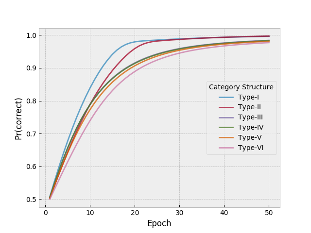

ALCOVE model
============

Reference : [Krus92]_

Module : :download:`alcove <../../../models/Alcove/alcove.py>`

The above module contains the necessary functions that aid in implementing the ALCOVE model. The documentation
for these functions is described below.

.. automodule:: Alcove.alcove
    :members:

Example
-------

A Sample Script : :download:`sample <../../../models/Alcove/sample.py>`

The above script illustrates how one can use the alcove module. As an example, the above script generates the plot in figure 5 of [Krus92]_ for non zero attentional learning.
The data set of [ShHJ61]_ is used.

.. rubric:: References
.. [Krus92] Kruschke, John K.: ALCOVE An Exemplar-Based Connectionist Model of Category Learning. In: Psychological Review. 1992, Vol. 99, No. 1, 22-44.
.. [ShHJ61] Shepard, R. N., Hovland; C. L.; Jenkins, H. M.: Learning and memorization of classifications. In: Psychological Monographs. 75(13, Whole No. 517).